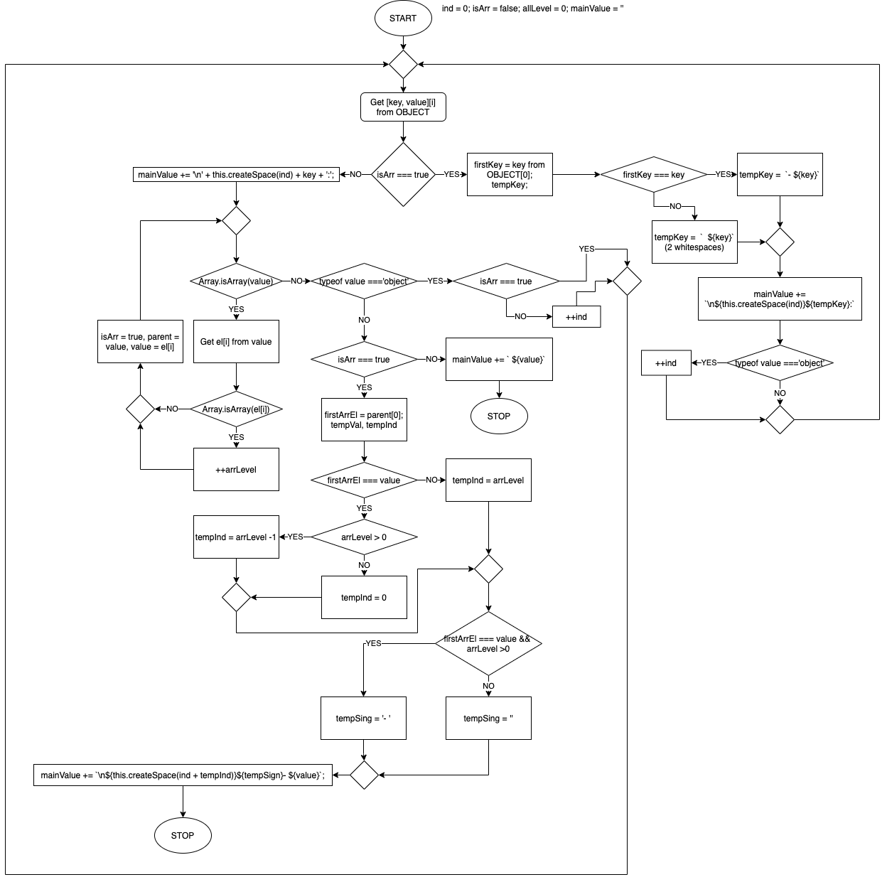

# YAML < - > JSON converter

Converter app with two endpoints. 

`http://127.0.0.1:3000/json` -> convert yaml to json
`http://127.0.0.1:3000/yaml` -> convert json to yaml

## Convert json to yaml



## How to run

### Localy by npm
```npm
npm i
npm start
```

## Tests
```npm
npm i
npm run test
```


